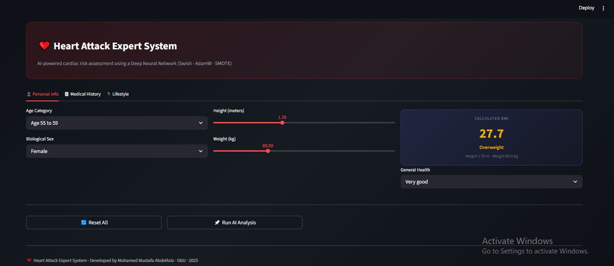
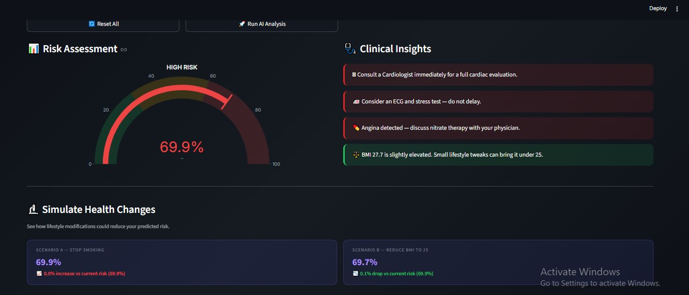

# ❤️ Heart Attack Expert System

> **AI-powered cardiovascular risk prediction** using a Deep Neural Network trained on 246,022 real patient records from the CDC BRFSS 2022 national health survey.

---

## 📸 Screenshots

### Patient Input Form

*Tabbed input form — Personal Info, Medical History, and Lifestyle tabs with live BMI calculator.*

### Risk Assessment & Clinical Insights

*Speedometer gauge showing risk probability, AI-generated clinical recommendations, and What-If simulation scenarios.*

---

## 🚀 Features

- **94% overall accuracy** with threshold-optimized inference (threshold = 0.75)
- **96% specificity** — correctly clearing healthy patients with minimal false alarms
- **48% recall** for heart disease patients on a fully imbalanced real-world test set
- **40-feature intelligent pipeline** with automated noise removal and ordinal encoding
- **What-If simulation** — models impact of smoking cessation and BMI reduction
- **Clinical Insights engine** — tier-based recommendations from the rule base
- **Production-grade architecture**: `model.h5` + `scaler.joblib` + `model_schema.json`

---

## 📁 Project Structure

```
heart-attack-expert-system/
│
├── data/
│   └── heart_2022_no_nans.csv          # CDC BRFSS 2022 dataset
│
├── models/
│   ├── expert_model.h5                 # Trained TensorFlow neural network
│   ├── scaler.joblib                   # Fitted ColumnTransformer (StandardScaler)
│   └── model_schema.json               # Feature spec, ordinal mappings, baselines
│
├── src/
│   ├── heart_disease_smote.py          # Full training pipeline
│   ├── schema_builder.py               # Generates model_schema.json from dataset
│   ├── inference_mapper.py             # UI input → scaled feature vector
│   └── app.py                          # Streamlit dashboard
│
└── README.md
```

---

## ⚙️ Installation & Setup

### Prerequisites

- Python 3.9+
- pip

### Install dependencies

```bash
pip install streamlit tensorflow scikit-learn pandas numpy plotly joblib imbalanced-learn
```

### Run the app

```bash
streamlit run app.py
```

The dashboard will open at `http://localhost:8501`.

---

## 🧠 Model Architecture

The system uses a **deep TensorFlow Sequential neural network** optimized for binary classification on highly imbalanced medical data.

| Component | Details |
|---|---|
| Framework | TensorFlow / Keras |
| Architecture | Deep Sequential (Dense + BatchNorm) |
| Activation | Swish |
| Optimizer | AdamW |
| Training Epochs | 74 (with early stopping) |
| Learning Rate Schedule | 1e-3 → 5e-4 → 2.5e-4 → 1.25e-4 |
| Class Balancing | SMOTE (1:1 ratio in training only) |
| Decision Threshold | 0.75 (tuned via F1-sweep) |

---

## 📊 Dataset

| Property | Value |
|---|---|
| Source | CDC BRFSS 2022 National Survey |
| Total Records | 246,022 patients |
| Training Set (post-SMOTE) | ~151,200 balanced records |
| Test Set | 36,904 records (real-world imbalance) |
| Features After Pruning | **40 clinically relevant features** |
| Feature Space | 9 numerical + 31 binary (one-hot) |

**14 noise features removed** during training: geographic identifiers, low-signal proxies, reverse-causation confounders, and non-predictive preventive features.

---

## 📈 Performance Results

Evaluated on a held-out test set of **36,904 records** with real-world class distribution (94.5% healthy, 5.5% heart disease).

| Metric | Our System | Literature Average |
|---|---|---|
| Overall Accuracy | **94%** | 84–92% |
| Precision – Heart Disease | **44%** | 33–95% |
| F1-Score – Heart Disease | **46%** | 38–95% |
| Specificity (Healthy Recall) | **96%** | 89–97% |
| Precision – Healthy | **97%** | 90–98% |
| Weighted F1-Score | **94%** | 88–95% |
| Optimal Threshold | **0.75 (tuned)** | 0.50 (default) |

---

## 🗂️ Pipeline Overview

```
Raw CSV (246,022 records)
        │
        ▼
 Noise Pruning (–14 features)
        │
        ▼
 Ordinal Encoding (SmokerStatus, ECigaretteUsage, GeneralHealth)
        │
        ▼
 One-Hot Encoding (categorical features, drop_first=True)
        │
        ▼
 SMOTE (training split only → 1:1 class balance)
        │
        ▼
 ColumnTransformer (StandardScaler on 9 numerical, passthrough on 31 binary)
        │
        ▼
 TensorFlow Sequential NN (Swish + AdamW + BatchNorm)
        │
        ▼
 Threshold Sweep (F1 @ 0.50–0.90) → best threshold = 0.75
        │
        ▼
 Saved: expert_model.h5 + scaler.joblib + model_schema.json
```

---

## 🔧 Key Modules

### `schema_builder.py`
Reads the training CSV and generates `model_schema.json` — the single source of truth for the inference pipeline. Captures: expected feature names, ordinal mappings, and population median/mode baselines.

```bash
python schema_builder.py
```

### `inference_mapper.py`
Transforms raw Streamlit UI inputs into the exact 40-feature scaled vector expected by the model. Missing inputs are filled with dataset population medians/modes from the schema.

### `app.py`
Streamlit dashboard featuring:
- **3-tab input form** (Personal Info / Medical History / Lifestyle)
- **Live BMI calculator** from height and weight sliders
- **Plotly speedometer gauge** for risk probability
- **Clinical Insights engine** with tier-based recommendations
- **What-If simulation** for smoking cessation and BMI reduction scenarios

---

## 👥 Authors

| Name | Student ID |
|---|---|
| Mohamed Ibrahim Abd El-Moneim Ismail | 202207000 |
| Mohamed Mostafa Abd El-Aziz Mohamed | 202207142 |

**Course:** Expert Systems  
**Supervisor:** Dr. Doaa Al-Beleidy  
**Institution:** October 6 University — 2025

---

## 📚 References

1. Abdullah, M. (2025). *Artificial intelligence-based framework for early detection of heart disease using enhanced multilayer perceptron.* Frontiers in Artificial Intelligence, 7:1539588.
2. Akkaya, B. et al. (2022). XGBoost-based heart disease prediction on CDC BRFSS 280K records.
3. Mamun, M. et al. (2022). Logistic Regression cardiovascular risk prediction. DUET, Bangladesh.
4. CDC Behavioral Risk Factor Surveillance System (BRFSS) 2022. U.S. Department of Health and Human Services. https://www.cdc.gov/brfss/

---

<p align="center">
  ❤️ Heart Attack Expert System · Expert Systems Course · O6U · 2026
</p>